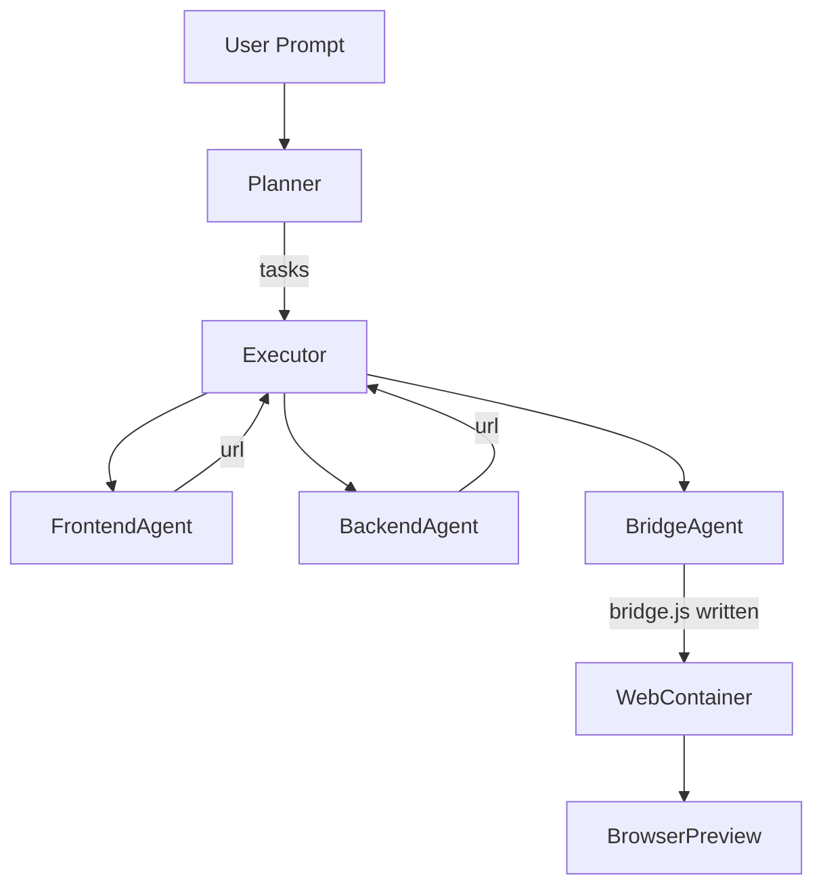

# 03_19_cross_sandbox_bridge

**Author:** Cascade AI • 2025-06-23

## Purpose
Document the design and implementation of the *cross-sandbox bridge* that links the UI running in a WebContainer with the API running in an E2B sandbox, enabling real-time interaction in the prototype.

## Problem
WebContainer (client-side) and E2B (cloud) sandboxes were integrated individually, but no mechanism existed for the front-end to discover and call the back-end at runtime. Manual URL copying would break the AI-first workflow and violate the live-preview experience described in the blueprint.

## Solution Overview
1. **BridgeAgent** – A new specialized agent that receives `frontend_url` and `backend_url` via task dependencies and generates `bridge.js` (a JS module that calls the back-end health endpoint).
2. **File persistence** – `BridgeAgent` now writes `bridge.js` directly into the WebContainer filesystem using `WebContainerTool.run(files={...})`.
3. **Script injection** – `FrontendDeveloperAgent` always includes `` in `index.html`, plus a placeholder `#backend-response` div.
4. **Executor dependency wiring** – The `DepartmentalExecutor`:
   • Tracks `origin_department` on completed tasks.
   • Injects artifact URLs into downstream task `input_data`.
   • Supplies `WebContainerTool` to Bridge tasks so they can write files.
5. **Planner auto-injection** – `CSuitePlanner` now auto-adds a Bridge task whenever it detects both a Frontend and Backend task in the plan.
6. **Tests**
   • `test_bridge_workflow.py` – verifies BridgeAgent flow.
   • `test_live_ui_fetch.py` – ensures `bridge.js` is persisted and `index.html` has the script tag.

## Flow Diagram

## Future Enhancements
* **Dynamic routes:** Allow BridgeAgent to inject multiple endpoints / WebSocket URLs.
* **Hot-reload hooks:** Use WebContainer file-watch API to auto-refresh browser on bridge updates.
* **Reverse-proxy pattern:** Replace direct fetch with a lightweight proxy for CORS-safe calls.

## Impact on Prototype
The bridge completes the round-trip experience:
* After agents finish, users open the WebContainer preview and immediately see the back-end JSON rendered.
* This matches the *Walk-Me-Through* and *Pro Mode* UX described in the blueprint.
* Sets foundation for more advanced real-time collaboration (e.g., streaming SSE, WebSockets, or polling dashboards).
