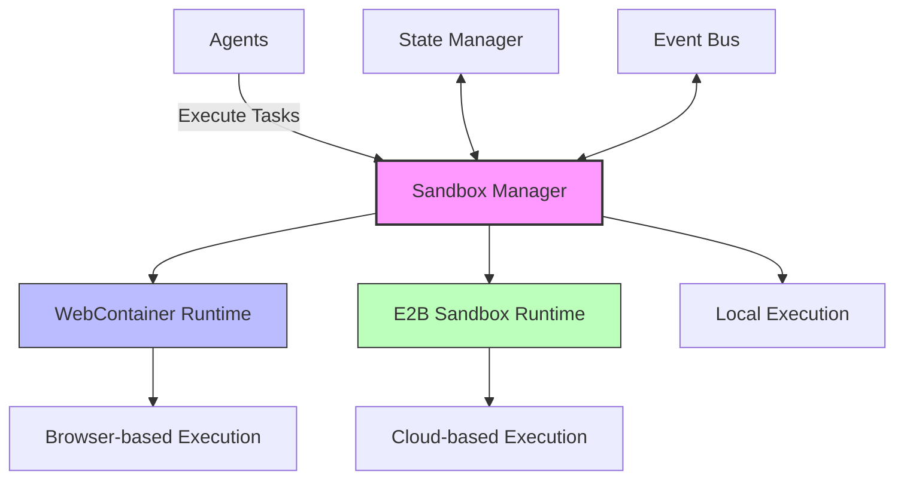
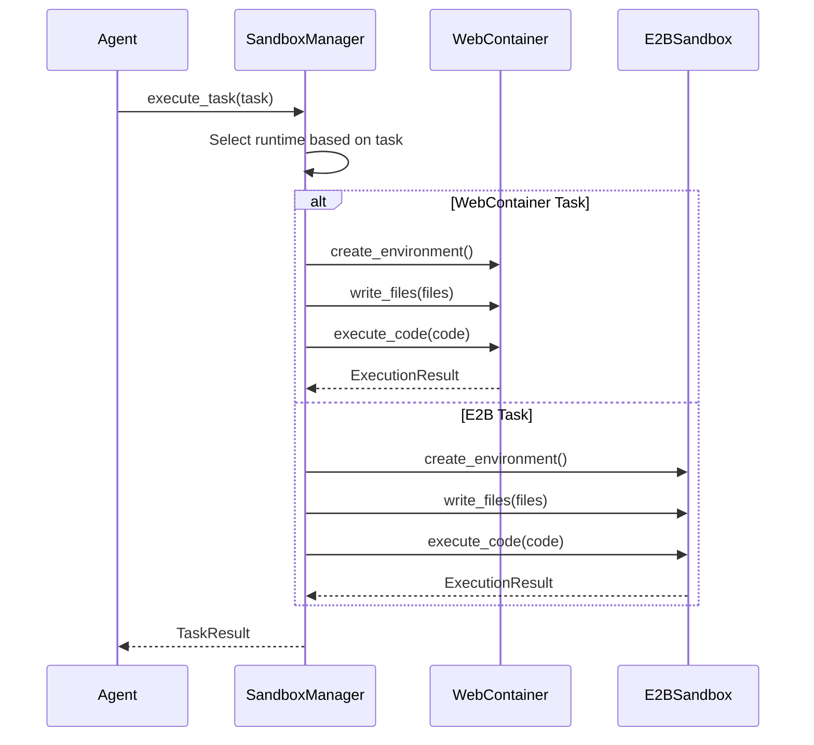

# Sandbox Runtime Integration Design

## Overview
This document outlines the architecture and implementation strategy for integrating WebContainer and E2B sandbox runtimes into Sentient Core. The design enables secure, isolated execution of code across different environments while maintaining a consistent interface for agent interactions.

## Architecture

### High-Level Components



## Core Components

### 1. Sandbox Manager

**Responsibilities:**
- Manage lifecycle of sandbox environments
- Route tasks to appropriate runtime
- Handle resource allocation and cleanup
- Provide unified interface for agents

**Interface:**
```python
class SandboxManager:
    async def create_environment(self, config: SandboxConfig) -> str:
        """Create a new sandbox environment"""
        
    async def execute_code(
        self, 
        env_id: str, 
        code: str, 
        files: Dict[str, str] = None
    ) -> ExecutionResult:
        """Execute code in the specified environment"""
        
    async def get_preview_url(self, env_id: str) -> Optional[str]:
        """Get preview URL for web-based environments"""
        
    async def cleanup(self, env_id: str):
        """Clean up environment resources"""
```

### 2. Runtime Implementations

#### 2.1 WebContainer Runtime

**Use Cases:**
- Frontend development and preview
- Browser-based applications
- Interactive demos

**Configuration:**
```yaml
webcontainer:
  enabled: true
  workdir: "/workspace"
  coep: "credentialless"
  forward_errors: true
  resources:
    memory_mb: 2048
    cpu_cores: 2
```

#### 2.2 E2B Runtime

**Use Cases:**
- Backend services
- Long-running processes
- Resource-intensive tasks

**Configuration:**
```yaml
e2b:
  enabled: true
  api_key: ${E2B_API_KEY}
  default_template: "python3"
  timeout_seconds: 600
  resources:
    memory_mb: 4096
    cpu_cores: 4
```

### 3. Execution Model



## Integration with Sentient Core

### 1. Agent Integration

```python
class BaseAgent:
    def __init__(self, sandbox_manager: Optional[SandboxManager] = None):
        self.sandbox = sandbox_manager or SandboxManager()
        self.env_id = None
        
    async def setup_environment(self, config: Dict[str, Any]):
        """Set up the execution environment"""
        self.env_id = await self.sandbox.create_environment(config)
        
    async def execute_task(self, task: Task) -> str:
        """Execute a task in the sandbox"""
        if not self.env_id:
            await self.setup_environment(self.default_config)
            
        # Write task files if any
        if task.files:
            await self.sandbox.write_files(self.env_id, task.files)
            
        # Execute the task
        result = await self.sandbox.execute_code(
            self.env_id,
            task.code,
            task.language
        )
        
        return self._process_result(result)
```

### 2. Task Execution Flow

1. **Task Creation**
   - Task is created with metadata (type, requirements, resources)
   - Task is assigned to an agent
   
2. **Environment Setup**
   - Agent requests environment from SandboxManager
   - Appropriate runtime is selected based on task requirements
   - Environment is initialized with necessary dependencies
   
3. **Code Execution**
   - Agent submits code and files to the environment
   - Runtime executes the code in isolation
   - Results are captured and returned
   
4. **Cleanup**
   - Environment is either persisted or cleaned up
   - Resources are released

## Security Considerations

1. **Isolation**
   - Each task runs in its own isolated environment
   - Network access is restricted by default
   - Filesystem access is scoped to the workspace
   
2. **Resource Limits**
   - CPU and memory limits are enforced
   - Execution timeouts are applied
   - Disk usage is monitored and limited
   
3. **Authentication**
   - All API calls require authentication
   - Environment access is scoped to the creating user/agent
   - Sensitive data is never logged or persisted

## Performance Considerations

1. **Caching**
   - Environment templates are cached
   - Dependencies are pre-installed in base images
   - File operations are batched when possible
   
2. **Scaling**
   - Stateless design allows horizontal scaling
   - Workloads are distributed across available runtimes
   - Resource usage is monitored and optimized

## Implementation Roadmap

### Phase 1: Core Infrastructure
- [ ] Implement SandboxManager interface
- [ ] Add WebContainer runtime
- [ ] Add E2B runtime
- [ ] Implement basic task execution

### Phase 2: Advanced Features
- [ ] Add support for persistent environments
- [ ] Implement file system synchronization
- [ ] Add support for custom templates
- [ ] Implement resource monitoring

### Phase 3: Optimization
- [ ] Add caching layer
- [ ] Implement connection pooling
- [ ] Add performance metrics
- [ ] Optimize startup time

## Monitoring and Observability

1. **Metrics**
   - Execution time
   - Resource usage
   - Error rates
   - Queue length
   
2. **Logging**
   - Detailed execution logs
   - Environment lifecycle events
   - Security-related events
   
3. **Tracing**
   - End-to-end request tracing
   - Performance profiling
   - Dependency tracking

## Error Handling

1. **Recovery**
   - Automatic retries for transient failures
   - Environment recreation on unrecoverable errors
   - Graceful degradation
   
2. **Reporting**
   - Detailed error messages
   - Contextual information
   - Suggested actions

## Testing Strategy

1. **Unit Tests**
   - Individual components
   - Edge cases
   - Error conditions
   
2. **Integration Tests**
   - End-to-end workflows
   - Cross-runtime operations
   - Failure scenarios
   
3. **Performance Tests**
   - Load testing
   - Stress testing
   - Resource usage validation

## Future Enhancements

1. **Multi-Runtime Support**
   - Add support for additional runtimes
   - Runtime auto-selection based on task requirements
   - Custom runtime plugins
   
2. **Collaboration**
   - Shared environments
   - Real-time collaboration
   - Access control
   
3. **Advanced Features**
   - Debugging support
   - Live reload
   - Hot module replacement
